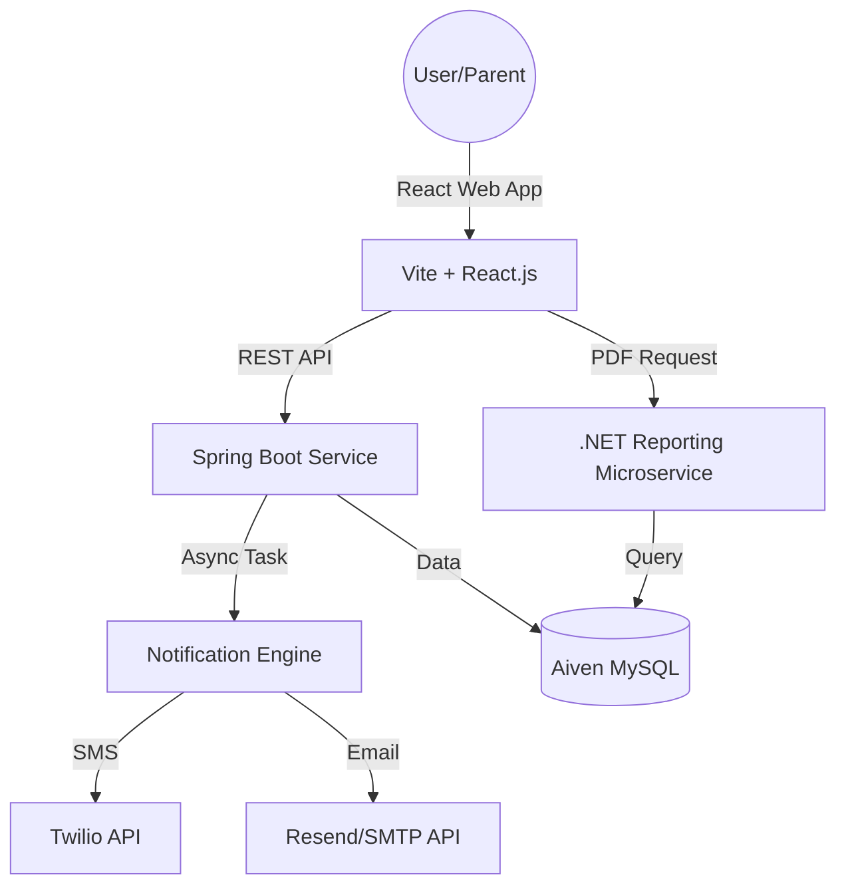

# 🎓 Student Assessment & Performance Tracker (SAPT)

A professional, full-stack microservice architecture designed to automate academic performance tracking, reporting, and real-time parent-teacher communication.

---

## 🚀 Live Environment
- **Frontend:** [SAPT Web Portal](https://student-assessment-and-performance.vercel.app/)
- **REST API:** [Backend Service](https://sapt-backend-production.up.railway.app/health)
- **Report Service:** [.NET PDF Engine](https://reporting-service-production-5bbb.up.railway.app/)

---

## ✨ Key Features

### 🔐 Role-Based Access Control (RBAC)
- **Admin Dashboard**: System-wide control for managing User (Faculty/Student) lifecycles and departmental configurations.
- **Faculty Portal**: Specialized interface for academic mark entry, subject management, and student trend analysis.
- **Student Dashboard**: Data-driven portal featuring performance visualizations and instant report downloads.

### 📊 Advanced Performance Analytics
- **Dynamic Charting**: Real-time visualization of academic progress using Chart.js.
- **Microservice Reporting**: Dedicated .NET Core engine for generating high-fidelity, professional academic PDF reports.

### 🤖 Intelligent Automation
- **Async Messaging**: High-throughput notification engine capable of handling 500+ concurrent tasks without latency.
- **Dual-Channel Alerts**: Automated SMS (Twilio) and Email (Resend/Gmail) notifications for every mark entry, keeping parents instantly informed of student progress.

---

## 🏗️ System Architecture

---

## 🛠️ Technology Stack

### Core Services
- **Primary Backend**: Java 21, Spring Boot 3.2.x (JPA, Security, Async)
- **Reporting Microservice**: .NET 9 Core, Dapper ORM, QuestPDF
- **Frontend Engine**: React.js, Vite, Chart.js, Lucide Icons
- **Database**: MySQL (Aiven Managed Cloud)

### Infrastructure & APIs
- **Cloud Hosting**: Railway (Backend), Vercel (Frontend)
- **Automation**: Twilio (SMS), Resend (Transactional Email)
- **Security**: Environment-driven secret management, CORS protection

---

## ⚙️ Local Setup & Development

### Prerequisites
- Java 21 JDK
- .NET 9 SDK
- Node.js & npm

### 1. Database Configuration
Local development uses a shared cloud database by default. If using a local DB:
1. Create `school_tracker_db`.
2. Configure credentials in `backend/src/main/resources/application-secret.properties`.

### 2. Service Initialization
Run the following scripts from the root directory to start the ecosystem:

| Service | Command |
| :--- | :--- |
| **Backend** | `.\start-backend.bat` |
| **Frontend** | `.\start-frontend.bat` |
| **Reporting** | `.\start-reporting-service.bat` |

---

## 👨‍💻 Developed By
**Dilip Nalage**
- [GitHub](https://github.com/dilipnalage1063) | [LinkedIn](https://www.linkedin.com/in/dilip-nalage-73889828a/)

**Vinit Darade**
- [GitHub](https://github.com/VinitDarade12) | [LinkedIn](https://www.linkedin.com/in/vinitdarade/)

---
*Developed as part of the CDAC Professional Project Curriculum.*
