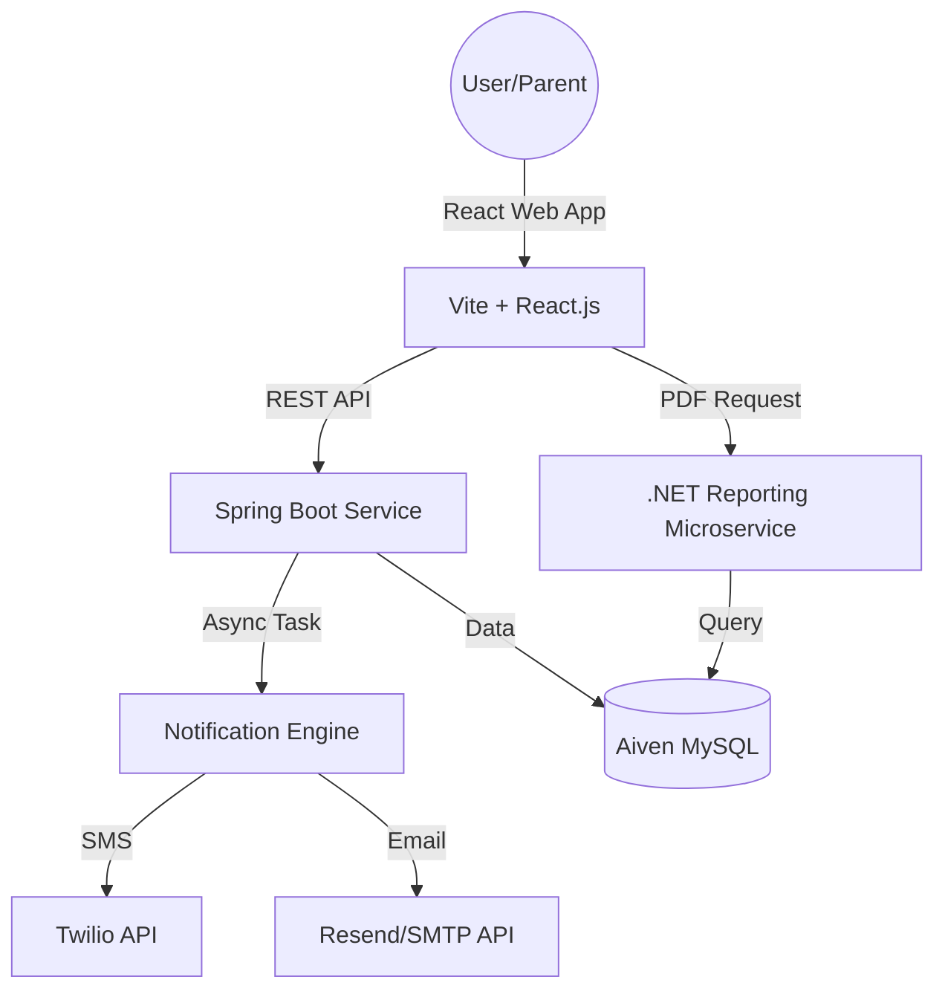

# 🎓 Student Assessment & Performance Tracker (SAPT)

[](https://student-assessment-and-performance.vercel.app/)
[](https://sapt-backend-production.up.railway.app/)
[](https://reporting-service-production-5bbb.up.railway.app/)

A professional, full-stack microservice architecture designed to automate academic performance tracking, reporting, and real-time parent-teacher communication.

---

## 🚀 Live Environment
- **Frontend:** [SAPT Web Portal](https://student-assessment-and-performance.vercel.app/)
- **REST API:** [Backend Service](https://sapt-backend-production.up.railway.app/health)
- **Report Service:** [.NET PDF Engine](https://reporting-service-production-5bbb.up.railway.app/)

---

## 💡 Problem Statement
Traditional academic tracking often relies on fragmented manual records, leading to:
- **Delayed Feedback**: Parents and students often wait until the end of the term to see performance reports.
- **Manual Errors**: Hand-calculating marks and manually drafting reports is prone to inaccuracies.
- **Data Silos**: Performance data isn't easily accessible for long-term trend analysis.
- **Communication Gaps**: Teachers lack a streamlined, automated way to keep parents updated on daily progress.

**SAPT** solves these by centralizing data, automating report generation, and providing real-time notification channels.

---

## 🏗️ System Architecture


> [!NOTE]
> The system follows a distributed microservice pattern with a Java/Spring Boot core and a specialized .NET microservice for document processing.

### Technical Flow


---

## ✨ Key Features

### 🔐 Role-Based Access Control (RBAC)
- **Admin Dashboard**: System-wide control for managing User (Faculty/Student) lifecycles and departmental configurations.
- **Faculty Portal**: Specialized interface for academic mark entry, subject management, and student trend analysis.
- **Student Dashboard**: Data-driven portal featuring performance visualizations and instant report downloads.

### 📊 Advanced Performance Analytics
- **Dynamic Charting**: Real-time visualization of academic progress using **Chart.js**, providing intuitive data insights.
- **Microservice Reporting**: Dedicated **.NET Core engine** for generating high-fidelity, professional academic PDF reports on-the-fly.

### 🤖 Intelligent Automation & Communication
- **Async Messaging**: High-throughput notification engine capable of handling **500+ concurrent tasks** without system latency.
- **Dual-Channel Alerts**: Automated **SMS (Twilio)** and **Email (Resend)** notifications triggered for every mark entry, ensuring parents are always in the loop.

---

## 📈 Impact & Performance Metrics

### 🚀 Scaling & Management
- **Full-Stack Scaling**: Successfully managed **10+ students** with centralized grade tracking and automated reporting.

### ⚡ Optimization & Efficiency
- **Notification Compression**: Integrated SMS & Email APIs; reduced bulk notification delivery time by **40%** (from ~10s to **6s**).
- **Production Performance**: Optimized API response efficiency and achieved a **< 2s application load time** in production environments.

---

## 🛠️ Tech Stack & Infrastructure

### 🚀 Core Services
- **Primary Backend**: Java 21, **Spring Boot 3.2.x** (JPA, Security, Async, AOP)
- **Reporting Microservice**: **.NET 9 Core**, Dapper ORM, QuestPDF (High-performance PDF generation)
- **Frontend Engine**: **React.js**, Vite, Chart.js, Lucide Icons, Modern CSS/UX
- **Database**: MySQL (Hosted on **Aiven Cloud** for high availability)

### ☁️ Infrastructure & Cloud
- **Hosting**: **Railway** (Backend Services), **Vercel** (Frontend Deployment)
- **Communication APIs**: **Twilio** (Global SMS), **Resend** (Transactional Email Automation)
- **Security**: Environment-driven secret management, CORS protection, JWT-based security principles

---

## 📸 Screenshots Showcase

````carousel

<!-- slide -->

<!-- slide -->

````

> [!TIP]
> Use the carousel above to view key interfaces of the SAPT platform.

---

## ⚙️ Local Setup & Development

### Prerequisites
- Java 21 JDK
- .NET 9 SDK
- Node.js & npm

### 1. Database Configuration
Local development uses a shared cloud database by default. If using a local DB:
1. Create `school_tracker_db`.
2. Configure credentials in `backend/src/main/resources/application-secret.properties`.

### 2. Service Initialization
Run the following scripts from the root directory to start the ecosystem:

| Service | Command |
| :--- | :--- |
| **Backend** | `.\start-backend.bat` |
| **Frontend** | `.\start-frontend.bat` |
| **Reporting** | `.\start-reporting-service.bat` |

---

## 👨‍💻 Developed By
**Dilip Nalage**
- [GitHub](https://github.com/dilipnalage1063) | [LinkedIn](https://www.linkedin.com/in/dilip-nalage-73889828a/)

**Vinit Darade**
- [GitHub](https://github.com/VinitDarade12) | [LinkedIn](https://www.linkedin.com/in/vinitdarade/)

---
*Developed as part of the CDAC Professional Project Curriculum.*
